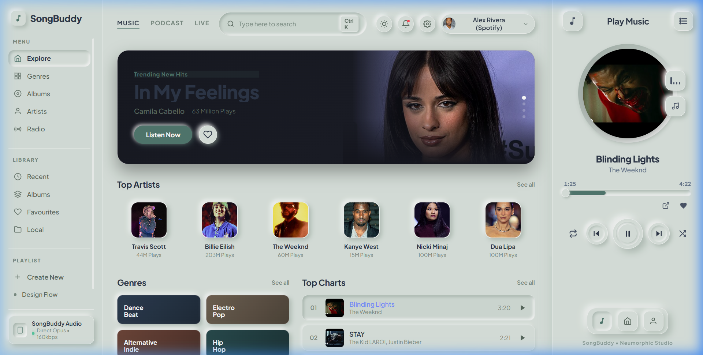
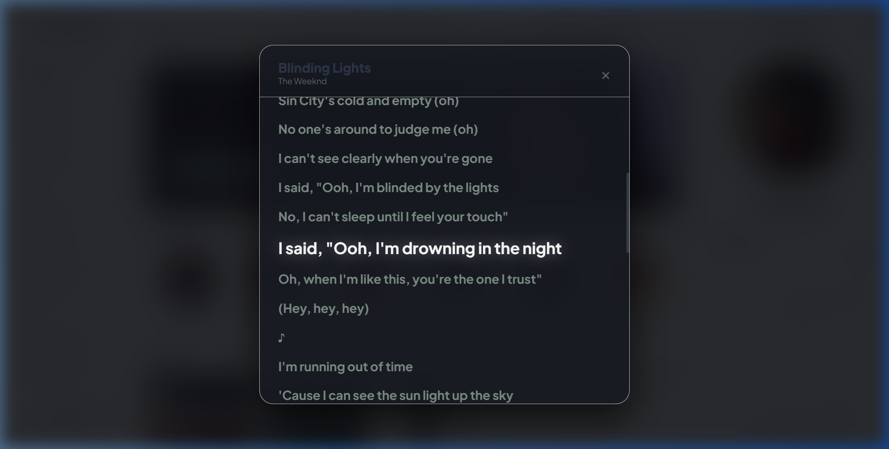

# SongBuddy 🎵
> **Real-Time Streaming Audio Client & Model Context Protocol (MCP) Engine**

[](LICENSE)
[](https://www.python.org/downloads/)
[](.github/workflows/ci.yml)
[](Dockerfile)
[](https://ffmpeg.org/download.html)

SongBuddy is a streaming-first audio application modeled after the modern Spotify user experience. It leverages upstream content delivery infrastructure (YouTube Music's CDN & InnerTube API) for real-time in-memory audio buffering with **zero local disk overhead** during playback.

The repository also includes the companion **spot-extractor** CLI and Model Context Protocol (MCP) Server for automated Spotify metadata inspection and offline tagging to a designated downloads directory.

---

## 📸 Preview



<p align="center">
  <em>High-fidelity glassmorphism interface with real-time playback, trending charts, and synchronized karaoke lyrics via LRCLIB.</em>
</p>

<details>
  <summary><b>View Synchronized Lyrics Interface</b></summary>

  
</details>

---

## 🌟 Key Features

- **Direct In-Memory Streaming**: Pipes high-fidelity Opus (~160 kbps) and AAC (~128 kbps) audio streams directly into browser memory with HTTP 206 Partial Content (Range requests) via lightweight `yt-dlp` stream resolution.
- **Clean Audio Pipeline**: Pure audio bitstreams are resolved and proxied on the fly without heavy video container rendering or unnecessary client-side player overhead.
- **Production Hardened & Monitored**: Equipped with Argon2 password hashing, signed JWT sessions, Pydantic input sanitization, multi-tier sliding-window rate limiting, and an `/api/health` observability endpoint.
- **Containerized & Cloud Ready**: Production-ready with non-root `Dockerfile`, `docker-compose.prod.yml`, automated health checks, and Nginx reverse proxy configurations.
- **YouTube Music Automix / Radio**: Starts an infinite radio queue from any seed track using YouTube Music's `RDAMVM` algorithmic endpoint (25–50 acoustically coherent tracks per batch).
- **Synchronized Karaoke Lyrics**: Integrated with the LRCLIB API to display synchronized, auto-scrolling lyrics where clicking any lyric line jumps playback directly to that timestamp.
- **Modern Glassmorphism UI**: High-fidelity dark/light theme, emerald accents, animated equalizer indicators, responsive queue drawer, and quick play grids.
- **Zero-Build Vanilla Frontend**: Built with pure HTML5, modern CSS, and modular JavaScript—served directly by the Python server without requiring Node.js, npm, or bundler build steps.
- **Native OS MediaSession Integration**: Bridges playback state, cover art, and transport controls to OS media overlays, lock screen controls, and keyboard media keys.
- **Spot-Extractor & MCP Server**: Exposes `inspect_spotify_url` and `download_spotify_track` tools to AI agents (Cursor, Claude Desktop, Antigravity).

---

## 🏗 System Architecture

```text
┌─────────────────────────────────────────────────────────────┐
│                      SongBuddy Web Client                   │
│  - Modern Glassmorphism Theme & Zero-Build Vanilla Stack    │
│  - Persistent Scrubber, Queue Drawer & Mini-Player          │
│  - Real-time Synchronized Scrolling Lyrics (LRCLIB)         │
└──────────────────────────────┬──────────────────────────────┘
                               │
               HTTP Requests (Range Audio & REST)
                               ▼
┌─────────────────────────────────────────────────────────────┐
│                   SongBuddy Streaming Engine                │
│  - In-Memory Stream Proxy with HTTP 206 Byte-Ranges         │
│  - Advanced Multi-Tier Rate Limiter & Ban Guard             │
│  - Argon2 Password Security & JWT Token Authentication      │
│  - Direct AAC/Opus CDN Resolver with LRU Caching            │
│  - Observability & Metrics Endpoint (/api/health)           │
└──────────────────────────────┬──────────────────────────────┘
                               │
                Companion Agent Server (Stdio)
                               ▼
┌─────────────────────────────────────────────────────────────┐
│                 spot-extractor MCP Server                   │
│  - inspect_spotify_url: Canonical metadata inspection       │
│  - download_spotify_track: ID3 tagging & high-res artwork   │
└─────────────────────────────────────────────────────────────┘
```

---

## 🚀 Quickstart

### 🐳 Option A: Docker (Fastest)

Run the containerized application with a single command:

```bash
docker compose up --build
```

Open your browser at **[http://127.0.0.1:8000/](http://127.0.0.1:8000/)**.

For production deployments with Nginx and SSL/TLS, see the [Production Deployment Guide](DEPLOYMENT.md).

---

### 🐍 Option B: Local Python Setup

#### 1. Prerequisites & Installation

- **Python 3.10+**
- **[FFmpeg](https://ffmpeg.org/download.html)** installed and available on your system `PATH` (required by `spot-extractor` for stream conversion to MP3 and embedded metadata tagging).
- **Zero-build Frontend**: No Node.js, Vite, or npm build required—static assets are served directly by the Python backend.

Clone the repository and install dependencies:

```bash
pip install -r requirements.txt
```

*(Optional: Set up environment configuration)*

```bash
# Linux / macOS / PowerShell:
cp .env.example .env

# Windows Command Prompt (cmd.exe):
copy .env.example .env
```

#### 2. Launch the SongBuddy Streaming App

Run the streaming server:

```bash
python server.py
```

Open your browser at **[http://127.0.0.1:8000/](http://127.0.0.1:8000/)**.

- **Play Music**: Click on any trending track or search for any song/artist.
- **Automix Radio**: Tap **"Start Automix Radio"** to generate a continuous 50-song queue matching the track's tempo and genre.
- **Lyrics**: Tap the **Lyrics** button in the bottom player bar or press `L` to view real-time scrolling karaoke lyrics.
- **Shortcuts**: `Space` (Play/Pause), `Ctrl+Right` (Next), `Ctrl+Left` (Previous), `L` (Lyrics), `Q` (Queue).

---

## 🛠 Spot-Extractor CLI & MCP Server

### Standalone CLI

To inspect or download a Spotify track/playlist with ID3 tags:

```bash
python main.py "https://open.spotify.com/track/4cOdK2wGLETKBW3PvgPWqT"
```

### Model Context Protocol (MCP) Server

SongBuddy provides an MCP server compatible with Claude Desktop, Cursor, and Antigravity.

#### Tool Configuration

Add this entry to your client configuration file (e.g. `claude_desktop_config.json`):

```json
{
  "mcpServers": {
    "songbuddy-extractor": {
      "command": "python",
      "args": [
        "/absolute/path/to/SongBuddy/mcp_server.py"
      ],
      "env": {
        "SPOTIPY_CLIENT_ID": "your_spotify_client_id_here",
        "SPOTIPY_CLIENT_SECRET": "your_spotify_client_secret_here",
        "DOWNLOAD_DIR": "./downloads"
      }
    }
  }
}
```

#### Available MCP Tools

- `inspect_spotify_url(spotify_url: str)`: Returns canonical title, artists, album, duration, ISRC, and cover artwork without downloading.
- `download_spotify_track(spotify_url: str, custom_output_dir: str)`: Resolves stream, converts to MP3, and embeds ID3 tags and album art into the output directory.

---

## 📡 Backend REST Endpoints

| Endpoint | Method | Description | Auth Required |
|---|---|---|---|
| `/` | `GET` | Serves the SongBuddy web application. | No |
| `/api/health` | `GET` | System health, uptime, and cache observability. | No |
| `/api/trending` | `GET` | Featured and top chart tracks for discovery. | No |
| `/api/search?q=<query>` | `GET` | Fast flat-extracted search results with sanitization. | Configurable |
| `/api/stream?id=<videoId>` | `GET` | Direct in-memory byte-range streaming proxy (HTTP 206). | Configurable |
| `/api/radio?id=<videoId>` | `GET` | 25–50 YouTube Music Automix recommendations. | Configurable |
| `/api/lyrics?track=...` | `GET` | Synchronized `.lrc` and plain text lyrics from LRCLIB. | Configurable |
| `/api/auth/register` | `POST` | User registration with Argon2 password hashing. | No |
| `/api/auth/login` | `POST` | User authentication returning signed JWT token. | No |
| `/api/auth/logout` | `POST` | Revokes active JWT token session. | Yes (Bearer) |

---

## 🧪 Automated Testing

Execute the test suite with coverage:

```bash
pytest --cov=. --cov-report=term-missing
```

---

## ⚠️ Known Limitations

- **Upstream CDN & Parser Drift**: Stream resolution depends on `yt-dlp`. If YouTube or YouTube Music updates their player algorithms or response schemas, audio extraction may temporarily degrade until `yt-dlp` is updated (`pip install -U yt-dlp`).
- **Regional Licensing & Geoblocking**: Certain tracks, official music videos, or regional releases may be geo-restricted depending on the server/host's public IP address.
- **Lyrics Coverage**: Real-time synchronized lyrics are powered by the crowdsourced [LRCLIB](https://lrclib.net/) database. Obscure, indie, or newly released songs may have unsynced lyrics or no lyrics available.
- **Spotify API Rate Limits**: Metadata resolution via `spot-extractor` requires Spotify Developer credentials and is subject to standard Spotify Web API rate limits.

---

## 🛡 License & Disclaimer

Distributed under the **MIT License**. See [`LICENSE`](LICENSE) for more information. For full production guidelines, review [`DEPLOYMENT.md`](DEPLOYMENT.md).

SongBuddy is an open-source educational implementation demonstrating real-time in-memory streaming pipelines, decoupled UI architecture, and the Model Context Protocol. For the streaming web client, audio bitstreams are piped directly into volatile browser memory without persistent disk caching. Offline MP3 downloads and ID3 metadata tagging are handled explicitly and exclusively by the optional `spot-extractor` utility when initiated by the user.
